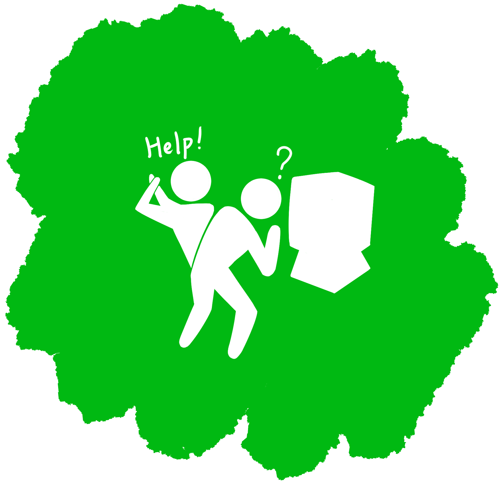

# 人はどのように作業をするか
## -行為の七段階理論-

---

## 回想

  

    
１．発表者が使ったことない映写機に

    
フィルムを通そうとしている

    
  

  

    
２．手助けがきて、議論が起こる  

    
  

  

  

    
３．会議の責任者が登場し、

    
聴衆たちに助けを求める 

    
  

  

    
４．技術者が解決

    
  

<!-- 図にしたい .このままだとわかりにくい-->
---

## Q. 映写機にフィルムを通すのが難しいは？ 
- 人が何かをするときに何が起きているかを知る **行為の構造**の検討が必要
<!-- 
なぜフィルムを通すのが困難だか、皆さん説明できますか？
ここでは、
 -->
---

## 行為の構造
### 行為＝**実行**+**評価**
- 実行
- -  何かをすること
- 評価
- - それをチェックすること
---
## 行為遂行のサイクル

    

flowchart TD
          A[ゴールの形成] --> B[意図の形成]
          B --> C[行為の詳細化]
          C --> D[行為の実行]
          D --> E[外界の状況の知覚]
          E --> F[外界の状況の解釈]
          F --> G[結果の評価]
  

---
### ４つの考えなければならないこと

- ゴール
- 外界に何をするか
- 外界そのもの
- 外界のチェック

---

# 人はどのように作業をするか

## ４つの考えなければならないこと

- ゴール
- 外界に何をするか ― 実行
- 外界そのもの
- 外界のチェック ― 評価
- ゴールを行為につなげるための表現変換 ― 意図

---

    

      flowchart TD
          A[ゴールの形成] --> B[意図の形成]
          B --> C[行為の詳細化]
          C --> D[行為の実行]
          D --> E[外界の状況の知覚]
          E --> F[外界の状況の解釈]
          F --> G[結果の評価]
  

---
## 行為の7段階についてまとめると

| カテゴリ | 段階名 | 
| :------- | :----- |
| **ゴール** | 1. ゴールの形成 |  
| **実行過程**| 2. 意図の形成 
|  **実行過程**|3. 行為の詳細化 
|  **評価過程**| 4. 外界の状況の知覚 |
|  **評価過程**| 5. 外界の状況の解釈 |  
|  **評価過程**| 6. 結果の評価|  

---

# 実行と評価におけるへだたり

---

## へだたり（gulf）
- 心の中にある意図・解釈・実際の行為・状況の間の距離
- 心の中の状態と外界の状態の間を切り離している
- 人が頭の中に作り上げる心理的な表現と外界の物理的な構成要素・状態の間存在する距離の一つの側面を反映

 

- **へだたりがあること　→　ユーザにとっての重大な困難**

---

## 実行におけるへだたり（gulf of execution）

- ユーザの意図とそのシステムで許される行為の差異
- ユーザが意図した通りの行為をどれだけ直感的に行えるかがこのへだたりの大きさの一つの尺度となる

---
## 実行におけるへだたりの例（映写機）

- 「映写機を準備してフィルムを上映する」という意図を達成するためにどんな行為をしなければならないかがまったく明らかでなかった
- 一方、フィルムを自動巻き付けする映写機やVTR（カセットを機械に押し込むだけ再生可能）は**へだたりに橋をかけている**といえる

---

## 評価におけるへだたり

- ユーザがシステムの物理的な状態を解釈したり、自分の予期や意図がどの程度よく満たされているかを判断する際にどのくらい努力をしなければならないか
- そのシステムはそのままの形で知覚可能で解釈可能か

---

## 評価におけるへだたりの例（映写機）

- フィルムが映写機の中に挿入されているとき、本当に正しく巻き取られているかを判断するのが困難
- VTRの場合はカセットがちゃんと入っていない場合は、機械に収まらず、飛び出す
→うまくいかなかったことがわかる

---

## デザインの手助けとしての行為の七段階理論

- デザインの貴重な手助けとなる
- ↓
- 評価と実行における隔たりに橋を架けることができているかどうかを確認するためのチェックリストとして利用可能
