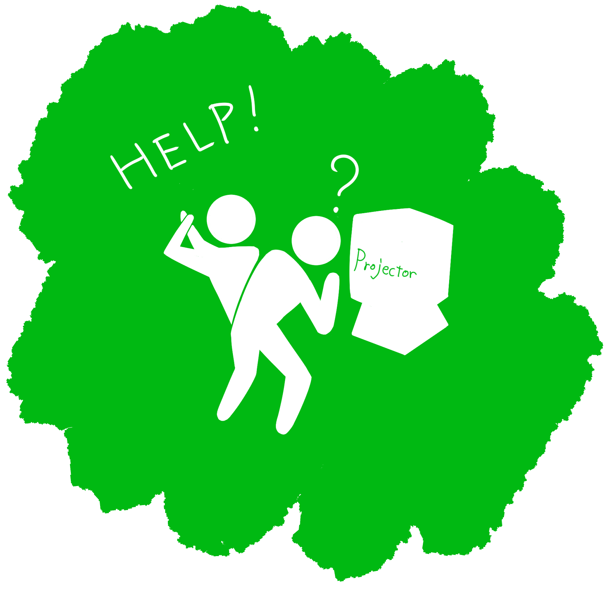
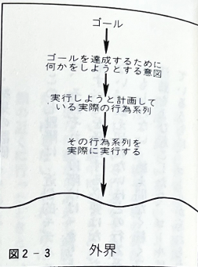
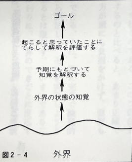

# 人はどのように作業をするか
## -行為の七段階理論-

---

## 回想
<!--これは、筆者がイタリアで会議に出席していた時の話です。-->

<!--発表者の一人がこれまでに使ったことのない映写機にフィルムを通そうとしているが、思うようにいかない-->

  

    
１．発表者が使ったことない映写機に

    
フィルムを通そうとしている

    

  

<!--誰かが助けに来て、どうやったらフィルムの端を巻取り側のリールに巻き付けられるかを議論している-->
  

    
２．手助けがきて、議論が起こる  

    
  

  

<!--会議の責任者が登場し、会議場で我慢強く待っていた聴衆たちに向き直り、助けを求めた-->

  

    
３．会議の責任者が登場し、

    
聴衆たちに助けを求める 

    
  

<!--青い服を着た技術者が現れ、フィルムを映写機から全部取り外し、もう一度通し、うまく映写し始めた-->
  

    
４．技術者が解決

    
  

---

## Q. 映写機にフィルムを通すのが難しいは？ 
- 人が何かをするときに何が起きているかを知る **行為の構造**の検討が必要
<!-- 
なぜフィルムを通すのが困難だか、皆さん説明できますか？
ここでは、行為の構造というものにのっとって検討していきましょう
 -->
---

## 行為の構造
### 行為＝実行+評価

  

    <ul>
      <li>実行＝何かをすること</li>
      <li>評価＝チェックすること</li>
    </ul>
  

  

  
  

### ゴール＝起こって欲しいこと
### 実行=外界に対して行ったこと
### 評価＝外界に実際に起きたこととゴールとの比較
<!-- 
まず、行為は2つのことに分類されます。実行と評価です。
実行する前に、行為をするものはゴール、つまり何をしたいかを策定します。それを達成するために外界に何かしらの働きかけを行います。その外界への働きかけを実行といいます。
実行した後は、それが目標のゴールと得られたものが合致しているかどうかを「評価します」
 -->

---
## 実行（ゴール→外界）の変換過程①
### ゴールは明確なものか？
$$\begin{pmatrix}
何か食べよう\\
身支度でもするか
\end{pmatrix}←はっきり記述されないゴール$$
$$このままでは行為につながらない...!$$
行為につなげるためにゴールを特定する、**意図**に表現を変換

<!-- 
実際の課題は、実行と評価のみで説明できるほど単純なものではありません。例えば、日常生活で何かしらの行動を起こそう、とするとき、「腹減ったし何か食べよう」とか「身支度でもするか」とかいったようなゴールを立てると思います。
以上のようなゴールは、ふんわりとしてますよね。即ち「何をどのように手に取りどうするのか」ははっきりと記述されていません。行為につなげるためには、ゴールはすべきことに関する特定の表現である「意図」に変換する必要があります。
 -->
---
## 実行（ゴール→外界）の変換過程②
### 意図を持った者は体を動かす
- 具体的行為＝「ゴールと意図」と「身体動作」を結びつける
  - 行為の詳細化
    - 何の行為をするか特定
  -  行為の実行
     - 実際に行為をする 

<!-- 
では、ゴールが意図に変換されただけで行為につながるのでしょうか？意図が形成されるだけでなく、実際に体を動かすフェーズがなければ、行為は実行されません。例えば、先ほどの「身支度をしよう」というゴールに対し、この服を手に取り着るという意図に変換される、というものを考えます。このとき、手元に服があれば簡単じゃないの？と考えるかもしれませんが、そうでない場合、服を手に取るといっても、クローゼットやタンスのところまで行く、服を見つけても首元が伸びないようにハンガーから外す、などといったような詳細な「行為系列」に変換され、意図が筋肉をコントロールできるようになります。
現状、これらの行為系列は頭の中にありますが、実際に「実行」されて外界に効果を及ぼすまでは何も起こりません。
 -->

 --- 
 # 実行（ゴール→外界）の変換まとめ
 

 

<!-- 
以上のことをこちらの図のようにまとめてあります。実行の段階は3フェーズあり、①ゴールの形成②意図の形成③行為の詳細化というものです。
 -->

---
 # 評価（外界→ゴール）の変換まとめ
 

 

<!-- 
行為＝実行＋評価であった。評価は、実行によって何が起こったのかをチェックするという性質があります。
その評価も3フェーズあります。
①外界の状況の知覚②外界の状況の解釈③結果の評価
まず、外界に何が起こったかを知覚し、その次に、その意味を理解しようとし、解釈し、最後にゴールと起ったことを比較します。
 -->

---
## 行為の7段階についてまとめると
 

| カテゴリ | 段階名 | 
| :------- | :----- |
| **ゴール** | 1. ゴールの形成 |  
| **実行過程**| 2. 意図の形成 
|  **実行過程**|3. 行為の詳細化 
|  **実行過程**|4. 行為の実行
|  **評価過程**| 5. 外界の状況の知覚 |
|  **評価過程**| 6. 外界の状況の解釈 |  
|  **評価過程**| 7. 結果の評価|  

 

<!-- 
以上をまとめると、行為＝実行＋評価。もっと細分化するとこの7フェーズある。
 -->

---
## 具体例~エレベーター~
 

| |
| -----|
|1. ゴールの形成 : 閉まるエレベーターのドアを開けたい
|2. 意図の形成 :閉まるエレベーターのドアを開けたい
|3. 行為の詳細化 :開けるボタンを押すための詳細な流れを組み立てる（人差し指で押す？それとも親指？）
|4. 行為の実行:間違って閉まるボタンを押す
|5. 外界の状況の知覚 :ドアが閉まる
|6. 外界の状況の解釈 :  ボタン間違えた？
|7. 結果の評価:  ゴールが達成されなかったため、恥ずかしい

 

---
## 補足
### 1 それぞれのフェーズは完全に分離されていない。
 - 多くの行動は7段階すべてを経由する必要はない。
### 2 多くの活動は1つの行為で完成するものではない
 - 1つの活動に対して数多の行為系列の存在
 - ゴール・意図は副次的に起こりうる

<!-- 
行為の七段階は近似的モデルである。
極端な例ですが、志望企業に内定するために必要なはたくさんの行為系列があります。副次的なゴールも生み出されたりする。
 -->
---

# 実行と評価におけるへだたり

---

## へだたり（gulf）
- 心の中にある意図・解釈・実際の行為・状況の間の距離
- 心の中の状態と外界の状態の間を切り離している
- 人が頭の中に作り上げる心理的な表現と外界の物理的な構成要素・状態の間存在する距離の一つの側面を反映

 

- **へだたりがあること　→　ユーザにとっての重大な困難**

---

## 実行におけるへだたり（gulf of execution）

- ユーザの意図とそのシステムで許される行為の差異
- ユーザが意図した通りの行為をどれだけ直感的に行えるかがこのへだたりの大きさの一つの尺度となる

---
## 実行におけるへだたりの例（映写機）

- 「映写機を準備してフィルムを上映する」という意図を達成するためにどんな行為をしなければならないかがまったく明らかでなかった
- 一方、フィルムを自動巻き付けする映写機やVTR（カセットを機械に押し込むだけ再生可能）は**へだたりに橋をかけている**といえる

---

## 評価におけるへだたり

- ユーザがシステムの物理的な状態を解釈したり、自分の予期や意図がどの程度よく満たされているかを判断する際にどのくらい努力をしなければならないか
- そのシステムはそのままの形で知覚可能で解釈可能か

---

## 評価におけるへだたりの例（映写機）

- フィルムが映写機の中に挿入されているとき、本当に正しく巻き取られているかを判断するのが困難
- VTRの場合はカセットがちゃんと入っていない場合は、機械に収まらず、飛び出す
→うまくいかなかったことがわかる

---

## デザインの手助けとしての行為の七段階理論

- デザインの貴重な手助けとなる
- ↓
- 評価と実行における隔たりに橋を架けることができているかどうかを確認するためのチェックリストとして利用可能
