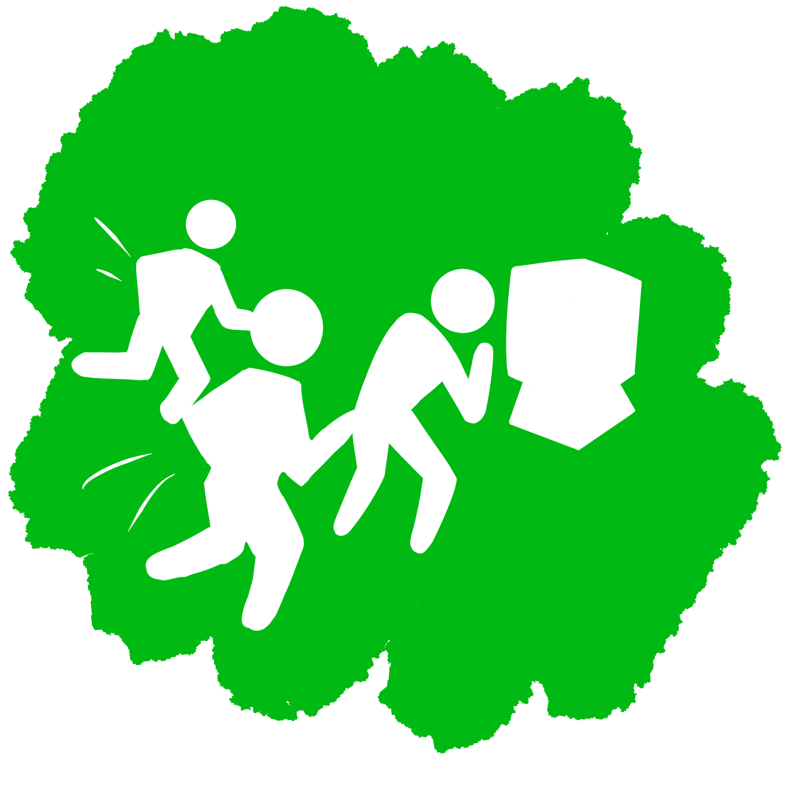
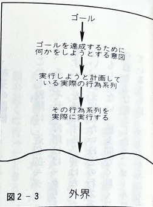
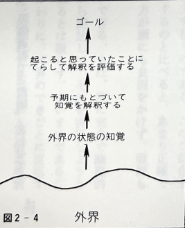

# How Do People Perform Tasks?
## - The Seven Stages of Action Theory -

---

## Recollection
<!-- This is a story about the author attending a conference in Italy. -->

<!-- A presenter tries to thread film through a projector they have never used before, but it doesn't go well. -->

  

    
1. The presenter tries to thread film through a projector they've never used before

    
  

<!-- Someone comes to help, and they discuss how to wind the end of the film onto the take-up reel. -->
  

    
2. Help arrives, and a discussion starts

    
  

<!-- The conference organizer appears, turns to the patiently waiting audience, and asks for help. -->

  

    
3. The organizer appears and asks the audience for help

    
  

<!-- A technician in blue appears, removes all the film, threads it again, and the projection starts successfully. -->
  

    
4. The technician solves the problem

    
  

---

## Q. Why is threading film through a projector difficult?
- To understand what happens when people do something, we need to consider the **structure of action**.
<!-- 
Can you explain why threading film is difficult?
Let's examine this using the structure of action.
-->
---

## Structure of Action
### Action = Execution + Evaluation

  

    <ul>
      <li>Execution = Doing something</li>
      <li>Evaluation = Checking the outcome</li>
    </ul>
  

  

  
  

### Goal = What you want to happen
### Execution = Actions performed on the external world
### Evaluation = Comparing what actually happened with the goal
<!-- 
First, actions are divided into two parts: execution and evaluation.
Before executing, the actor sets a goal—what they want to achieve. They then act on the external world to achieve it (execution).
After executing, they evaluate whether the outcome matches the goal.
-->

---
## Transformation Process of Execution (Goal → World) ①
### Is the goal clear?
$$\begin{pmatrix}
Let's eat something\\
Maybe I'll get ready
\end{pmatrix} \leftarrow Vague goals $$
$$ These do not lead directly to action...! $$
To connect to action, transform the goal into a specific **intention**

<!-- 
In real life, execution and evaluation alone are not enough to explain tasks. For example, when you decide "I'm hungry, let's eat" or "Maybe I'll get ready," these are vague goals.
Such goals are not clearly described. To lead to action, they must be transformed into specific "intentions."
-->
---
## Transformation Process of Execution (Goal → World) ②
### Once you have an intention, you move your body
- Concrete actions = Linking "goal and intention" with "bodily movement"
  - Detailing the action
    - Specify what action to take
  - Performing the action
    - Actually doing it

<!-- 
Does having an intention immediately lead to action? Not only must intentions be formed, but there must also be a phase where the body is moved.
For example, for the goal "get ready," you might form the intention "pick up these clothes and put them on." If the clothes are not at hand, you need to go to the closet, take them off the hanger, etc.
These action sequences are in your mind, but nothing happens until you actually execute them.
-->

---
# Summary of Execution (Goal → World) Transformation

<!-- 
This diagram summarizes the above. The execution phase has three stages: (1) goal formation, (2) intention formation, (3) action specification.
-->

---
# Summary of Evaluation (World → Goal) Transformation

<!-- 
Action = execution + evaluation. Evaluation checks what happened as a result of execution.
Evaluation also has three stages:
(1) Perception of the state of the world
(2) Interpretation of the state of the world
(3) Evaluation of the outcome
First, you perceive what happened, then interpret its meaning, and finally compare it with the goal.
-->

---
## Summary of the Seven Stages of Action

| Category | Stage Name | 
| :------- | :----- |
| **Goal** | 1. Forming the goal |  
| **Execution**| 2. Forming the intention 
|  **Execution**|3. Specifying the action 
|  **Execution**|4. Executing the action
|  **Evaluation**| 5. Perceiving the state of the world |
|  **Evaluation**| 6. Interpreting the state of the world |  
|  **Evaluation**| 7. Evaluating the outcome|  

<!-- 
To summarize: Action = Execution + Evaluation. More specifically, there are these seven phases.
-->

---
## Concrete Example ~ Elevator ~
### You are in a company elevator. Just as the doors are closing, your boss comes running from the other side, clearly wanting to get in.

---
## Concrete Example ~ Elevator 1 ~

| |
| -----|
|1. **Forming the goal**: Want to open the closing elevator doors
|2. **Forming the intention**: Want to open the closing elevator doors
|3. **Specifying the action**: Plan the detailed steps to press the open button (which finger to use?)
|4. **Executing the action**: Press the open button
|5. **Perceiving the state of the world**: The door opens
|6. **Interpreting the state of the world**: Realize the door opened
|7. **Evaluating the outcome**: Glad to have achieved the goal!

---
## Concrete Example ~ Elevator 2 ~

| |
| -----|
|1. **Forming the goal**: Want to open the closing elevator doors
|2. **Forming the intention**: Want to open the closing elevator doors
|3. **Specifying the action**: Plan the detailed steps to press the open button (which finger to use?)
|4. **Executing the action**: Accidentally press the close button
|5. **Perceiving the state of the world**: The door closes
|6. **Interpreting the state of the world**: Did I press the wrong button?
|7. **Evaluating the outcome**: Embarrassed because the goal was not achieved

---
## Supplement
### 1. Each phase is not completely separated.
 - Many actions do not go through all seven stages.
### 2. Many activities are not completed in a single action.
 - Multiple action sequences exist for one activity
 - Goals and intentions may arise as sub-goals

<!-- 
The seven stages of action are an approximate model.
For example, getting a job at your desired company involves many action sequences and sub-goals.
-->
---

# Gulfs in Execution and Evaluation

---

## Gulfs (gulf)
- The distance between intentions, interpretations, actual actions, and situations in the mind
- The separation between the state in the mind and the state of the external world
- Reflects one aspect of the distance between psychological representations and the physical components and states of the external world

 

- **The existence of a gulf → Major difficulty for users**

---

## Gulf of Execution

- The difference between the user's intention and the actions allowed by the system
- How intuitively the user can perform actions as intended is one measure of the size of this gulf

---
## Example of Gulf of Execution (Projector)

- It was not at all clear what actions were needed to achieve the intention of "setting up the projector and showing the film"
- On the other hand, projectors with automatic film threading or VCRs (where you just insert the cassette and it plays) can be said to **bridge the gulf**

---

## Gulf of Evaluation

- How much effort is required for the user to interpret the physical state of the system and judge how well their expectations or intentions have been met
- Is the system perceivable and interpretable as it is?

---

## Example of Gulf of Evaluation (Projector)

- When the film is inserted into the projector, it is difficult to judge whether it is wound correctly
- In the case of a VCR, if the cassette is not inserted properly, it will not fit and will pop out
→ You can tell when something has gone wrong

---

## Seven Stages of Action Theory as a Design Aid

- Provides valuable assistance in design
- ↓
- Can be used as a checklist to see if the gulfs in execution and evaluation are